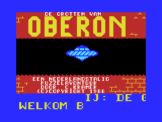
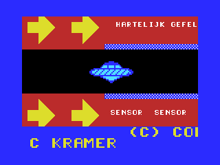
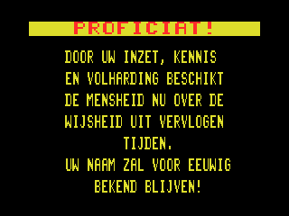
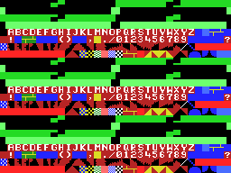
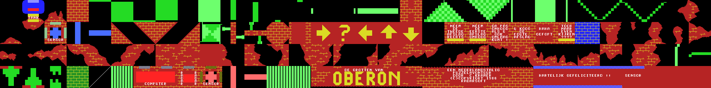
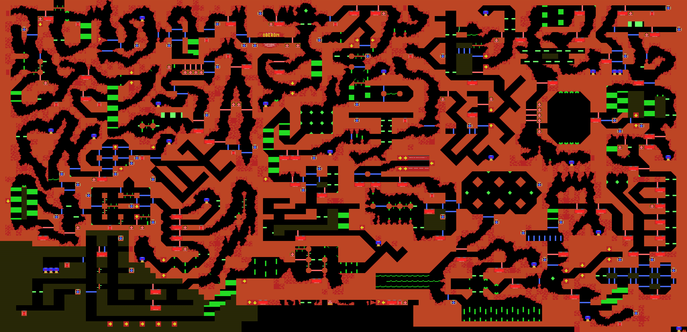

# Introduction

As a 1980s kid, I used to play a game called "The Caves of Oberon" and was always impressed with the sheer size of the map that I had to navigate.

Now, 40 years later, I thought it would be a fun little hobby project to do some 'digital archaeology' and try to construct the full map, including all its moving parts, into a single image to be able to see it in all its glory.

There have been various releases of this game on different platforms and under different names:
[MobyGames - The Caves of Oberon](https://www.mobygames.com/game/84320/the-caves-of-oberon/). The version I have based my work on is the one that I played when I was young, which is the Dutch version released for [MSX 1](https://en.wikipedia.org/wiki/MSX) in 1986: [Wikipedia – De Grotten van Oberon](https://nl.wikipedia.org/wiki/De_Grotten_van_Oberon) For ease of use I have analyzed the disk version of the game. It should be more or less identical to cassette release — which is the version I actually played back then.

After some digging, experimentation and scripting I was able to reconstruct the full map into a single animated image. And here is the final result:

> **Warning**: The image below is quite large (~45MB).


---

## Table of Contents

- [Game Objective & Player Start](#game-objective-player-start)
- [Game Files](#game-files)
  - [`AUTOEXEC.BAS`](#autoexecbas)
  - [`OBERON.BAS`](#oberonbas)
  - [`OBERON.001`](#oberon001)
  - [`OBERON.002`](#oberon002)
  - [`OBERON.003`](#oberon003)
  - [`OBERON.004`](#oberon004)
- [Map Reconstruction](#map-reconstruction)
  - [VRAM Layout](#vram-layout)
  - [Map Layout](#map-layout)
    - [Cell Blocks](#cell-blocks)
    - [Block Grid](#block-grid)
- [Formats](#formats)
  - [.BIN File](#bin-file)
- [Trivia](#trivia)
  - [Unused Cells And Blocks](#unused-cells-and-blocks)
  - [Claimed Map Size](#claimed-map-size)
- [Credits](#credits)


---

## Game Objective & Player Start

Here is a quick summary of the game for those who might not be (fully) familiar with it.

The player starts at the top of the map, just below the “Oberon” logo, flying a UFO-like spacecraft.



The objective is to reach the **data vault**, located near the center of the map. It’s marked by double arrows and the message _“Hartelijk gefeliciteerd!!”_ — which is Dutch for: **“Congratulations!!”**



To gain access, the player must navigate a puzzle-like maze:
- **Blue barriers** must be rotated between horizontal and vertical orientations
- **Red barriers** can be temporarily disabled by correctly answering a question at one of the terminals

There’s no time limit, but the player must regularly **refuel** by docking with one of the fuel tanks scattered throughout the level.

Once the goal is reached, the player is rewarded with the following screen:



> “**Congratulations!** Through your dedication, knowledge and perseverance, humanity now has the wisdom of times gone by.  
> Your name will be known forever!”


---

## Game Files

Here you will find an overview of the game files and what appears to be stored in them.

Some notes:
* MSX home computers utilized a [Zilog Z80 CPU](https://en.wikipedia.org/wiki/Zilog_Z80). This is an 8-bit CPU that processes 16-bit word values in little-endian order: first the low-byte, then the high-byte.
* Hexadecimal values are prefixed with 0x.

### `AUTOEXEC.BAS`

This is just a simple BASIC script that will make the game automatically run when rebooting the machine with the disk in the drive. 

```
10 LOAD"oberon.bas",R
```

### `OBERON.BAS`

This BASIC script does the actual loading and initialization of the game.

It starts off with the infamous `poke -1,170` to make sure memory is selected in the secondary memory slots. 

Then it switches to a tile screen mode with higher fidelity ('SCREEN 2') and runs the first binary, which does nothing more than write the loading screen image into video memory.

Then it loads up 3 more binaries that are the actual game and starts running.

```
5 POKE-1,170
10 SCREEN2:COLOR15,1,1:CLS
20 BLOAD"OBERON.001",R
30 BLOAD"OBERON.002",R
40 BLOAD"OBERON.003",R
50 BLOAD"OBERON.004",R
```

### `OBERON.001`

This is actually a [.BIN file](#bin-file): Start = 0x8300, End = 0x9701, Execution = 0x8300.

It contains the loading screen which it will write into VRAM so that it becomes visible.


### `OBERON.002`

This is actually a [.BIN file](#bin-file): Start = 0x8300, End = 0xC501, Execution = 0x843C.

It contains all the map data and the 'blocks' that are used to compress it. When the binary runs it copies all the relevant information into memory page 0 (0x0000–0x3FFF) segment 3.

Also see [Constructing The Map](#constructing-the-map).


### `OBERON.003`

This is actually a [.BIN file](#bin-file): Start = 0x8300, End = 0xC501, Execution = 0x8445.

It contains the SCREEN 2 cell (= 'tile') pattern and color data for the game.
It probably also contains all the randomized puzzle questions that are asked to the player.


### `OBERON.004`

This is actually a [.BIN file](#bin-file): Start = 0x8200, End = 0xBA00, Execution = 0xB891.

This seems to be the actual game logic.


---

## Map Reconstruction

Here you will find how we can interpret all the binary data and use it to fully construct the map.

### VRAM Layout

To understand how the data is encoded, we can use a modern MSX emulator such as [openMSX](https://openmsx.org/), which has excellent built-in debug visualization functionality.

If we look at the in-game configuration of the VDP and its VRAM, we can see the following:

| Property | Value/Comment |
|----------|---------------|
| Screen mode | SCREEN 2 (or 'GRAPHIC2' as it is referred to in the official VDP hardware documentation)|
| Pattern Generator Table | 0x0000 |
| Pattern Name Table | 0x1800 |
| Pattern Color table | 0x2000 |

The combined Pattern Generator and Pattern Color tables look like this:



We can immediately see that the 3 'sub-tables' (top, middle, bottom) that are available in SCREEN 2 are basically duplicates of each other, which makes sense as the view window of the game covers the entire screen. 

Important: You may find that some of the colors as shown in the screenshot differ from the raw data that can be found in the binaries. This is correct because the game does the following:

> The game sets VDP register 7 to `0x44`, which remaps color index `0` (normally black) to appear as color index `4` (dark blue) when cells are rendered onto the screen.


The cells themselves have the following functionality:

| Cell Range | Usage / Comment |
|------------|-----------------|
| 0–127   | These are the cells that the game updates constantly to 'animate' all the dynamic obstacles. The update frequency is linked to the VDP refresh rate (50 Hz for PAL, 60 Hz for NTSC) |
| 128        | Empty (so this is where the player can move safely) |
| 129–154 | Characters: A–Z |
| 155        | Part of the fuel tank |
| 156        | ??? |
| 157–158 | Terrain |
| 159        | Background for the scroll text at the bottom of the screen |
| 160        | Character: Space |
| 161        | Character: Exclamation ! |
| 162–167 | ??? |
| 168–169 | Characters: Brackets ( ) |
| 170–171 | ??? |
| 172        | Character: Comma , |
| 173        | <ul><li>Part of the fuel tank.</li><li>Also used for terrain (as part of the large-font wall text)</li></ul> |
| 174        | Character: Period . |
| 175        | Character: Slash forward / |
| 176–185 | Characters: 0–9 |
| 186–190 | ??? |
| 191        | Character: Question mark ? |
| 192        | Interaction surface of 'sensors' to trigger the 'game completed' screen when you reached the center of the maze |
| 193–216 | Terrain |
| 217–219 | ??? |
| 220–232 | <ul><li>Terminal text where questions are shown by writing patterns directly into the cells (max length , and also used to animate the cursor and such. Maximum text length is 232 - 220 + 1 = 13 characters)</li><li>Radar screen where the player's position is shown</li><li>Fuel counter display when docked to the fuel tank</li></ul> |
| 233–234 | Terrain |
| 235        | Interaction surface for puzzle terminals that temporarily disable all red barriers when questions answered correctly |
| 236        | Interaction surface of 'sensors' that temporarily disables all red barriers immediately |
| 237        | Interaction surface of 'sensors' that toggle between horizontal or vertical blue barriers |
| 238        | Horizontal and vertical red barriers that will be temporarily disabled when a puzzle is answered correctly |
| 239        | Interaction surface of 'fuel tanks' that allow the player to replenish fuel |
| 240        | Interaction surface of 'radars' that show the player's position in the map |
| 241–242 | Terrain |
| 243        | ??? |
| 244–249 | Terrain |
| 250–253 | ??? |
| 254        | Vertical barriers (blue when enabled, otherwise black) |
| 255        | Horizontal barriers (blue when enabled, otherwise black) |

The raw data for the cell patterns and colors are located in the [`OBERON.003`](#oberon003) file:

| Cell Range | Start In File | Comments |
|------------|---------------|----------|
| Cell Patterns 128–255 | 1543 | Cell patterns 0–127 are omitted because these are computed procedurally and updated in VRAM every frame as part of the animation obstacles |
| Cell Colors 0–255 | 2567 | For some reason, colors for cell 159 (used for the background for the bottom of the screen) are modified at run-time. <ul><li>In file: value = 0xD4. Foreground = 13, background = 4</li><li>In VRAM at run-time: value = 0x44. Foreground = 4, background = 4</li></ul>So, only the foreground color is changed, although this does not have any effect in-game because the scroll text at the bottom of the screen is all done with sprites anyways. |


### Map Layout

This section explains how the map data is structured and stored.

#### Cell Blocks

A simple ‘compression’ strategy has been applied whereby the map is composed out of larger ‘blocks’ of cells.

These blocks are 8 x 8 cells in dimension. And, as each cell is, of course, 8 x 8 pixels, this means a block spans 64 x 64 pixels in total.

There seems to be 8192 bytes (= 8 kB) reserved for storing these blocks. The encoding is a bit weird though as the blocks are not grouped individually, but instead the horizontal rows of the blocks appear sequentially next to each other in consecutive lines of 256 bytes.

This results in a 'block grid' of 32 x 4 = 128 blocks. Which is 256 x 32 cells.

The raw data for this is located in [`OBERON.002`](#oberon002):

* Start in file: 8711
* Range: 8192

When we visualize this we obtain the following:



Note: The animating dynamic obstacles are some of the first blocks. What is shown here is just a 'snapshot' of VRAM to illustrate what is shown inside them.


#### Block Grid

Luckily, the map itself is encoded in a very straightforward fashion as this is a grid of (0-based) block indices that move from left to right and in top to bottom order.

It appears the dimensions of the map is 128 x 62 blocks.

The raw data for this is located in [`OBERON.002`](#oberon002):

* Start in file: 8711
* Range: 8192

When we visualize this we obtain the following:



Notes:
* The effect of VDP register 7 has not been taken into account in this visualization.
* As you can see, near the bottom there are areas that look 'unfinished'/'unused'. These can however never been seen normally by the player.


## Formats

### .BIN File

These are binary files that often contain combinations of code and raw data. MSX BASIC expects there to be [7 additional header bytes](https://www.msx.org/wiki/MSX-BASIC_file_formats#MSX-BASIC_binary_files) that have the following meaning:

* Header:
  * Byte: 0xFE (type of file)
  * Word: Start address
  * Word: End address
  * Word: Execution address
* Followed by the actual binary data.


---

## Trivia

### Unused Cells And Blocks

Not all cells appear to be used, which is not so surprising. However, we also find that 17 blocks are never referenced by the block grid and thus will never show up in the game: 24, 52, 53, 54, 55, 56, 57, 64, 65, 99, 100, 101, 108, 109, 125, 126 and 127. 

Some of these blocks look rather ‘undefined’, but a couple of them are clearly not:


These contain text in Dutch that translate to English as follows:

| Dutch | English |
|-------|---------|
| “Neem de tweede afslag rechts” | "Take the second exit on the right" |
| “Neem de eerste afslag omhoog” | "Take the first exit up" |
| “Ga pas omhoog als U ook omlaag kunt !” | "Don't go up until you can go down" |
| “U koos de foute afslag” | "You took the wrong turn" |
| “Haha gefopt” | "Haha, fooled" |
| “Toch maar even kijken ????” | "Still went to have a look ????" |

Maybe the author of the game originally intended to add some hints and/or taunts for the player?


### Claimed Map Size

The game came packaged in a [box](https://www.generation-msx.nl/software/radarsoft/de-grotten-van-oberon/release/2583/) that has some (marketing) text that claims the game offers 500 unique screens in size.

However, when we look at the data we have found, we can deduce the following:

On MSX 1, the SCREEN 2 resolution is: 256 x 192 pixels.

The map has the following dimensions:

| Unit | Width | Height |
|------|-------|--------|
| Block = 8 x 8 cells | 128 | 62 |
| Cell = 8 x 8 pixels | 1024 | 496 |
| Pixels | 8292 | 3968 |
| Screen = 256 x 192 pixels | 32 | 20 |

So this would actually result in 32 x 20 = 640 screens. Even if we exclude that some parts of the map at the bottom are 'unused', 
this number would still be well above the already impressive claimed 500 screens shown on the box!


---

## Special Thanks

- [openMSX](https://openmsx.org/) - for making it possible to analyze VRAM in real time.
- [Python](https://www.python.org/) - for making it easy to write scripting for analysis and data visualization.
- [ChatGPT](https://chatgpt.com/) - for being an infinite source of wisdom.
- C.Kramer / Radarsoft - for the magic of cramming such a large game into such a small home computer.


